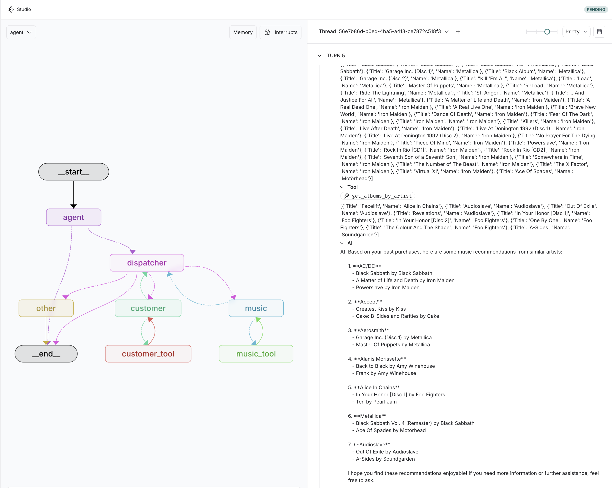

# LangGraph Cloud Example

This is an example chatbot agent which can lookup and update customer info and past purchases, and provide music recommendations.

This example was built from langgraph-example.

## Demo
- hi what can you help me with?
- lets update user information
- Customer ID is 1, First Name is Luís, and Last Name is Gonçalves
- state to SA
- provide me music recommendations from similar artists based on my past purchased albums